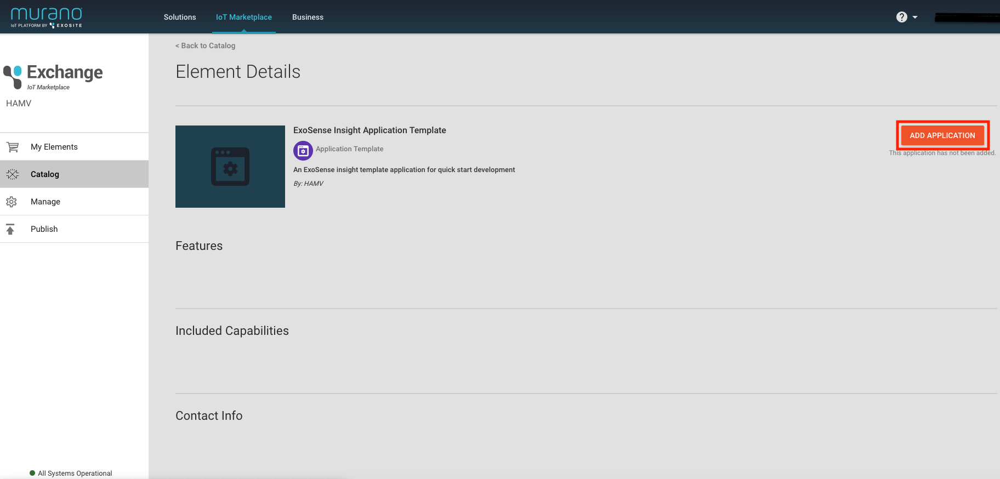

# ExoSense™ Insight with Murano How-To Guide

This guide provide the steps for quickly establish a murano application with example insight function.

## Requirements
* Having an ExoSense instance
* Having a murano account 

### Steps
1. Login Murano
2. Select the business of your ExoSense application
3. Go to IoT Marketplace and Click Publish on Navbar
4. Create a New Exchange Element and publish it with following information  
Element name: ExoSense Insight Application Template  
Element type: Application  
GitHub repo url: https://github.com/henryloexo/exosense_insight_example_murano_lua/tree/exchange  
Short Description: An ExoSense insight template application for quick start development  

5. View the element 
6. Click add application in element details page

7. Click Create application

8. Fill in a proper application domain name and click enable solution

9. Modify the host of insight-template.yaml in this repository as the insight application domain name just created

10. Repeat step 2~3 to create and publish another exchange element with following information  
Element name: A proper name  
Element type: Service  
Turn on the switch of enable swagger content and paste content in insight-template.yaml into text area of swagger file content and make sure the host has been modified  

11. View the element 
12. Click add service in element details page
13. (This step need to create a support ticket for Exosite support engineer)  
Enter the murano management page to enable the added service for ExoSense instance
14. Enter the ExoSense asset modify page, when you try to add a transform, you will see the newly added type "My Demo Insight"
